# Plan: Unix Platform Environment Variable Handling — Resilience Fix

## Production Issue

In production, the installation process terminates when it fails to write environment variables to shell RC files. The error message is like:
> "failed to append environment vars to shell profile: '/path/to/.bashrc'"

This happens because [`config_env_vars()`](src/core/os/unix.rs:17) uses `?` to propagate errors from [`utils::write_file()`](rim_common/src/utils/file_system.rs:99), causing the entire installation to abort when any single RC file write fails.

**Root cause**: The `?` operator at [line 35-40](src/core/os/unix.rs:35) turns any file write failure into a fatal error.

## Design Principle

**Env var operations must be best-effort and never halt the process.** The core installation (toolchain, tools) should succeed even if shell profile modifications fail. Users can always manually configure their environment.

## Current Code Analysis

### Install path — [`config_env_vars()`](src/core/os/unix.rs:17)

```
Line 24: utils::ensure_dir(&backup_dir)?;          // FATAL: can abort install
Line 35-40: utils::write_file(&rc, ...).with_context(..)?;  // FATAL: can abort install
```

### Uninstall path — [`remove_rustup_env_vars()`](src/core/os/unix.rs:74)

```
Line 78: remove_all_config_section()  // Returns Result, propagated
Line 92: utils::read_to_string("rc", path)?;  // FATAL: can abort uninstall
Line 119: })?;  // FATAL: can abort uninstall
```

### PATH modification — [`modify_path()`](src/core/os/unix.rs:162)

```
Line 163: utils::path_to_str(path)?;  // FATAL
Line 174: env::set_var("PATH", env::join_paths(splited)?);  // FATAL
Line 184: utils::read_to_string("rc", rc)?;  // FATAL
Line 204-209: utils::write_file(rc, ...).with_context(..)?;  // FATAL
```

### Panic points

```
Line 58: path.file_name().unwrap()  // PANIC if path has no filename
Line 130: assert!(end_pos >= start_pos)  // PANIC if markers malformed
Line 149: assert!(end_pos >= start_pos)  // PANIC if markers malformed
```

## Proposed Changes

### Change 1: Make `config_env_vars()` resilient

**File**: [`src/core/os/unix.rs`](src/core/os/unix.rs), lines 17-52

**Before**:
```rust
fn config_env_vars(&self) -> Result<()> {
    let vars_raw = self.env_vars()?;
    if !GlobalOpts::get().no_modify_env() {
        info!("{}", t!("install_env_config"));
        let backup_dir = self.install_dir.join("backup");
        utils::ensure_dir(&backup_dir)?;                    // <-- FATAL
        for sh in shell::get_available_shells() {
            for rc in sh.update_rcs() {
                _ = create_backup_for_rc(&rc, &backup_dir);
                let old_content = utils::read_to_string("rc", &rc).unwrap_or_default();
                let new_content = rc_content_with_env_vars(sh.as_ref(), &old_content, &vars_raw);
                utils::write_file(&rc, &new_content, false)  // <-- FATAL
                    .with_context(|| format!(...))?;
            }
        }
    }
    for (key, val) in vars_raw {
        env::set_var(key, val);
    }
    self.inc_progress(2.0)
}
```

**After**:
```rust
fn config_env_vars(&self) -> Result<()> {
    let vars_raw = self.env_vars()?;
    if !GlobalOpts::get().no_modify_env() {
        info!("{}", t!("install_env_config"));
        let backup_dir = self.install_dir.join("backup");
        if let Err(e) = utils::ensure_dir(&backup_dir) {    // <-- WARN only
            warn!("failed to create backup directory: {e}");
        }
        for sh in shell::get_available_shells() {
            for rc in sh.update_rcs() {
                _ = create_backup_for_rc(&rc, &backup_dir);
                let old_content = utils::read_to_string("rc", &rc).unwrap_or_default();
                let new_content = rc_content_with_env_vars(sh.as_ref(), &old_content, &vars_raw);
                if let Err(e) = utils::write_file(&rc, &new_content, false) {  // <-- WARN only
                    warn!(
                        "failed to write environment vars to shell profile '{}': {e}",
                        rc.display()
                    );
                }
            }
        }
    }
    // Setting env for current process is still critical
    for (key, val) in vars_raw {
        env::set_var(key, val);
    }
    self.inc_progress(2.0)
}
```

### Change 2: Make `remove_rustup_env_vars()` / `remove_all_config_section()` resilient

**File**: [`src/core/os/unix.rs`](src/core/os/unix.rs), lines 72-124

Make `remove_all_config_section()` log warnings instead of returning errors. Each RC file cleanup should be independent — failure on one should not prevent cleanup of others.

**Before**:
```rust
fn remove_rustup_env_vars(&self) -> Result<()> {
    if GlobalOpts::get().no_modify_env() { return Ok(()); }
    remove_all_config_section()
}

fn remove_all_config_section() -> Result<()> {
    for sh in shell::get_available_shells() {
        for rc in sh.rcfiles().iter().filter(|rc| rc.is_file()) {
            remove_section_or_warn_(rc, &to_remove_summary, |cont| {
                remove_sub_string_between(cont, start, end)
            })?;                                              // <-- FATAL
        }
    }
    Ok(())
}
```

**After**:
```rust
fn remove_rustup_env_vars(&self) -> Result<()> {
    if GlobalOpts::get().no_modify_env() { return Ok(()); }
    remove_all_config_section();  // No longer returns Result
    Ok(())
}

fn remove_all_config_section() {
    for sh in shell::get_available_shells() {
        for rc in sh.rcfiles().iter().filter(|rc| rc.is_file()) {
            if let Err(e) = remove_section_or_warn_(rc, &to_remove_summary, |cont| {
                remove_sub_string_between(cont, start, end)
            }) {
                warn!("failed to clean config section from '{}': {e}", rc.display());
            }
        }
    }
}
```

### Change 3: Make `modify_path()` resilient

**File**: [`src/core/os/unix.rs`](src/core/os/unix.rs), lines 162-214

The PATH modification should not abort the process. If writing to one RC file fails, continue with others.

**Before**:
```rust
fn modify_path(path: &Path, remove: bool) -> Result<()> {
    let path_str = utils::path_to_str(path)?;
    // ... current process PATH update ...
    for sh in shell::get_available_shells() {
        for rc in sh.update_rcs().iter().filter(|rc| rc.is_file()) {
            let rc_content = utils::read_to_string("rc", rc)?;     // <-- FATAL
            // ...
            utils::write_file(rc, &new_content, false).with_context(|| ...)?;  // <-- FATAL
        }
    }
    Ok(())
}
```

**After**:
```rust
fn modify_path(path: &Path, remove: bool) -> Result<()> {
    let path_str = utils::path_to_str(path)?;
    // ... current process PATH update (keep as-is, this is critical) ...
    if GlobalOpts::get().no_modify_path() { return Ok(()); }
    for sh in shell::get_available_shells() {
        for rc in sh.update_rcs().iter().filter(|rc| rc.is_file()) {
            let rc_content = match utils::read_to_string("rc", rc) {
                Ok(c) => c,
                Err(e) => {
                    warn!("failed to read shell profile '{}': {e}", rc.display());
                    continue;
                }
            };
            // ...
            if let Err(e) = utils::write_file(rc, &new_content, false) {
                warn!("failed to update PATH in shell profile '{}': {e}", rc.display());
            }
        }
    }
    Ok(())
}
```

### Change 4: Remove `assert!` panics

**File**: [`src/core/os/unix.rs`](src/core/os/unix.rs), lines 126-160

**Before**:
```rust
fn remove_sub_string_between(input: String, start: &str, end: &str) -> Option<String> {
    let start_pos = input.lines().position(|line| line == start)?;
    let end_pos = input.lines().position(|line| line == end)?;
    assert!(end_pos >= start_pos, "...");  // <-- PANIC
    // ...
}

fn get_sub_string_between(input: &str, start: &str, end: &str) -> Option<String> {
    let start_pos = input.lines().position(|line| line == start)?;
    let end_pos = input.lines().position(|line| line == end)?;
    assert!(end_pos >= start_pos, "...");  // <-- PANIC
    // ...
}
```

**After**:
```rust
fn remove_sub_string_between(input: String, start: &str, end: &str) -> Option<String> {
    let start_pos = input.lines().position(|line| line == start)?;
    let end_pos = input.lines().position(|line| line == end)?;
    if end_pos < start_pos {
        return None;  // Malformed section, skip gracefully
    }
    // ...
}

fn get_sub_string_between(input: &str, start: &str, end: &str) -> Option<String> {
    let start_pos = input.lines().position(|line| line == start)?;
    let end_pos = input.lines().position(|line| line == end)?;
    if end_pos < start_pos {
        return None;  // Malformed section, skip gracefully
    }
    // ...
}
```

### Change 5: Fix `create_backup_for_rc` unwrap

**File**: [`src/core/os/unix.rs`](src/core/os/unix.rs), line 58

**Before**:
```rust
let rc_filename = path.file_name().unwrap();  // <-- PANIC
```

**After**:
```rust
let Some(rc_filename) = path.file_name() else {
    return Ok(());  // No filename, skip backup
};
```

### Change 6: Make `remove_self()` resilient on Unix

**File**: [`src/core/os/unix.rs`](src/core/os/unix.rs), line 81-85

**Before**:
```rust
fn remove_self(&self) -> Result<()> {
    std::fs::remove_dir_all(&self.install_dir)?;  // <-- FATAL
    Ok(())
}
```

**After**:
```rust
fn remove_self(&self) -> Result<()> {
    if let Err(e) = std::fs::remove_dir_all(&self.install_dir) {
        warn!("failed to remove install directory '{}': {e}", self.install_dir.display());
    }
    Ok(())
}
```

## Architecture Diagram

```mermaid
flowchart TD
    subgraph Install - config_env_vars
        A[Get env vars map] --> B{no_modify_env?}
        B -->|yes| F[Set env for current process]
        B -->|no| C[Create backup dir - warn on fail]
        C --> D{For each shell + RC file}
        D --> D1[Backup RC - ignore fail]
        D1 --> D2[Read old content - default empty]
        D2 --> D3[Write new content]
        D3 -->|fail| D4[Log warning, continue next RC]
        D3 -->|ok| D
        D --> F
    end

    subgraph Uninstall - remove_rustup_env_vars
        K{no_modify_env?} -->|yes| K1[Return Ok]
        K -->|no| L{For each shell + RC file}
        L --> M[Read RC content]
        M -->|fail| M1[Log warning, continue]
        M -->|ok| N[Remove config section]
        N --> O[Write back]
        O -->|fail| O1[Log warning, continue]
        O -->|ok| L
    end

    subgraph PATH - modify_path
        P[Update current process PATH] --> Q{no_modify_path?}
        Q -->|yes| Q1[Return Ok]
        Q -->|no| R{For each shell + RC file}
        R --> S[Read RC]
        S -->|fail| S1[Log warning, continue]
        S -->|ok| T[Modify PATH in section]
        T --> U[Write back]
        U -->|fail| U1[Log warning, continue]
        U -->|ok| R
    end
```



## Summary of All Changes

| # | File | Line | Issue | Fix |
|---|------|------|-------|-----|
| 1 | `unix.rs` | 24 | `ensure_dir(&backup_dir)?` aborts install | Change to `if let Err` + warn |
| 2 | `unix.rs` | 35-40 | `write_file(...)?` aborts install | Change to `if let Err` + warn + continue |
| 3 | `unix.rs` | 58 | `path.file_name().unwrap()` panics | Change to `let Some(...) else return` |
| 4 | `unix.rs` | 78 | `remove_all_config_section()` returns Result | Make it return `()`, warn internally |
| 5 | `unix.rs` | 92 | `read_to_string(...)?` aborts uninstall | Change to match + warn + continue |
| 6 | `unix.rs` | 119 | `remove_section_or_warn_(...)?` aborts | Change to `if let Err` + warn |
| 7 | `unix.rs` | 130 | `assert!` panics on malformed section | Change to `if ... return None` |
| 8 | `unix.rs` | 149 | `assert!` panics on malformed section | Change to `if ... return None` |
| 9 | `unix.rs` | 163 | `path_to_str(path)?` in modify_path | Keep as-is (needed for logic) |
| 10 | `unix.rs` | 184 | `read_to_string(...)?` aborts PATH mod | Change to match + warn + continue |
| 11 | `unix.rs` | 204-209 | `write_file(...)?` aborts PATH mod | Change to `if let Err` + warn |
| 12 | `unix.rs` | 83 | `remove_dir_all(...)?` aborts uninstall | Change to `if let Err` + warn |

## Implementation Order

1. Fix panic points (Changes 3, 4, 7, 8) — prevent crashes
2. Fix `config_env_vars()` resilience (Changes 1, 2) — fix the production issue
3. Fix `remove_all_config_section()` resilience (Changes 5, 6) — prevent uninstall failures
4. Fix `modify_path()` resilience (Changes 10, 11) — prevent PATH modification failures
5. Fix `remove_self()` resilience (Change 12) — prevent uninstall abort
6. Update existing tests to verify no panics on malformed input
7. Add new tests for error resilience scenarios
